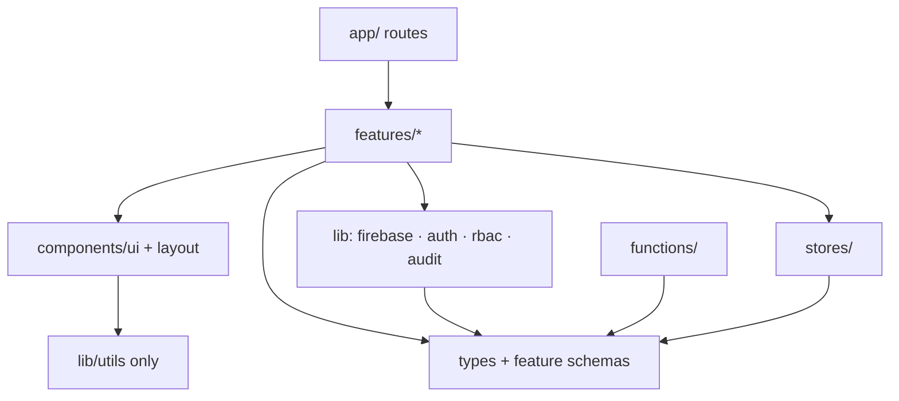
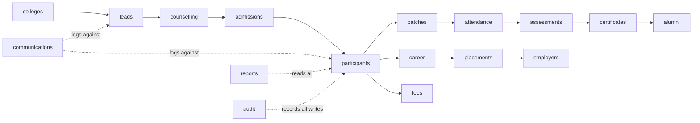

# 01 — Project Architecture

**TerraNext Business OS · Architecture Blueprint**
Status: Draft for review · Depends on: BRD v1.0, Master Doc (file.md)

---

## 1. Overall Solution Architecture

The platform is three deployable surfaces over one shared Firebase project (`terranextglobal`):

```
┌────────────────────────┐   ┌────────────────────────┐   ┌─────────────────────────┐
│   Public Website        │   │   CRM Application       │   │  Future Portals          │
│   (exists: terranext/)  │   │   (this build: crm/)    │   │  (student/parent/        │
│   Next.js · App Hosting │   │   Next.js · App Hosting │   │   employer — Phase 17)   │
│   backend:              │   │   backend:              │   │                          │
│   terranext-production  │   │   terranext-crm         │   │                          │
└───────────┬────────────┘   └───────────┬────────────┘   └───────────┬─────────────┘
            │ /apply form                │ staff auth (custom claims)  │ portal auth
            │ → createLead (Function)    │                             │ (future claims)
            ▼                            ▼                             ▼
┌──────────────────────────────────────────────────────────────────────────────────────┐
│                        Firebase Project: terranextglobal                              │
│  ┌──────────────┐  ┌──────────────────────────────┐  ┌────────────┐  ┌────────────┐  │
│  │ Firebase Auth │  │ Firestore                     │  │ Storage    │  │ Functions  │  │
│  │ custom claims │  │ = Shared Participant Data     │  │ documents, │  │ provisioning│ │
│  │ (role, scope) │  │   Layer (BRD Section 20)      │  │ uploads    │  │ leads, IDs, │ │
│  └──────────────┘  └──────────────────────────────┘  └────────────┘  │ certificates│ │
│                                                                       └────────────┘  │
└──────────────────────────────────────────────────────────────────────────────────────┘
```

Key properties:

- **One Firestore database is the Shared Participant Data Layer** (BRD Section 20). Website, CRM, and future portals never own their own copies of participant data — they are different lenses over the same records. This is how "One Participant – One Lifetime Digital Record" (BR-01) is enforced physically, not just by policy.
- **The website never writes Firestore directly.** Its `/apply` form calls a `createLead` HTTPS Function which validates, dedupes (FR-01.4: match on phone/email), and creates/updates the Lead (BR-07). Public clients get zero Firestore write access.
- **The CRM is the only interactive Firestore client in this phase.** Security rules are written for staff claims only; portal claims are reserved namespaces (see Doc 12).

## 2. Layered Architecture (within the CRM app)

```
┌────────────────────────────────────────────────────────┐
│ Presentation      app/ routes · features/*/components   │  RSC + client components
├────────────────────────────────────────────────────────┤
│ Application       features/*/hooks · features/*/actions │  TanStack Query hooks,
│                   (server actions for mutations)        │  Zustand for session/UI
├────────────────────────────────────────────────────────┤
│ Domain            features/*/schema · features/*/logic  │  Zod schemas = the domain
│                   types/ (shared)                       │  model; pure business rules
├────────────────────────────────────────────────────────┤
│ Infrastructure    lib/firebase · lib/audit · lib/rbac   │  Firestore converters,
│                   lib/auth · functions/                 │  Admin SDK, rules
└────────────────────────────────────────────────────────┘
```

Rules of the layers:

1. Dependencies point **downward only**. Domain code imports nothing from React, Next.js, or Firebase — it is Zod schemas + pure functions, so it can later be shared with mobile apps and portals (Doc 12).
2. Business rules BR-01…BR-09 live in the **domain layer** as named, testable functions (e.g. `canConvertLead(lead): Result` implements BR-02), never inline in components or Functions.
3. All Firestore access goes through **typed converters + repository helpers** in infrastructure. No raw `doc()/collection()` calls in features.
4. Mutations that must be atomic or privileged (participant ID issuance, claims, certificate generation) run in **Cloud Functions / server actions with the Admin SDK**, never trusting the client.

## 3. Module Architecture

The 20 modules from Master Doc Phase 08 map to feature packages. Grouped by lifecycle stage:

| Group | Feature modules | Primary writes |
|---|---|---|
| Platform (Milestone 1) | `auth`, `users`, `rbac-admin`, `audit`, `settings`, `dashboard` | users, auditLogs, settings |
| Acquisition | `leads`, `counselling`, `colleges` | leads, counsellingSessions, colleges |
| Admission & Academic | `admissions`, `participants`, `programmes`, `batches`, `attendance`, `assessments`, `certificates` | participants(+enrolments), academies/programmes/batches, sessions/attendance, certificates |
| Career & Beyond | `career`, `placements`, `employers`, `alumni` | careerProfiles, placements, employers |
| Operations | `fees`, `communications`, `reports` | feeAccounts/payments, communications |

Module rule: **a feature may read another feature's data only through that feature's exported hooks/queries** — never by importing its Firestore paths directly (enforced by import rules, Doc 02 §5).

## 4. Package Dependency Diagram



Forbidden edges (lint-enforced): `components/ui → features`, `lib → features`, `types → anything`, `features/A → features/B/internal`.

## 5. Feature Dependency Diagram

Lifecycle order defines allowed cross-feature reads (matches the Master Workflow, Phase 12):



`reports`, `communications`, and `audit` are **cross-cutting consumers** — they read broadly but no feature depends on them. `dashboard` composes read-only widgets exported by each feature.

## 6. Decisions Locked by This Document

| # | Decision | Rationale |
|---|---|---|
| A-1 | Separate CRM app, shared Firebase project | User-approved; clean security boundary vs public site |
| A-2 | Website writes leads only via `createLead` Function | BR-07 + zero public Firestore access |
| A-3 | Domain layer is framework-free (Zod + pure TS) | Reuse across portals/mobile (Doc 12) |
| A-4 | Business rules BR-01…09 are named domain functions | Traceability to BRD; unit-testable |
| A-5 | Privileged mutations via Admin SDK only | Client cannot mint Participant IDs, claims, certificates |
