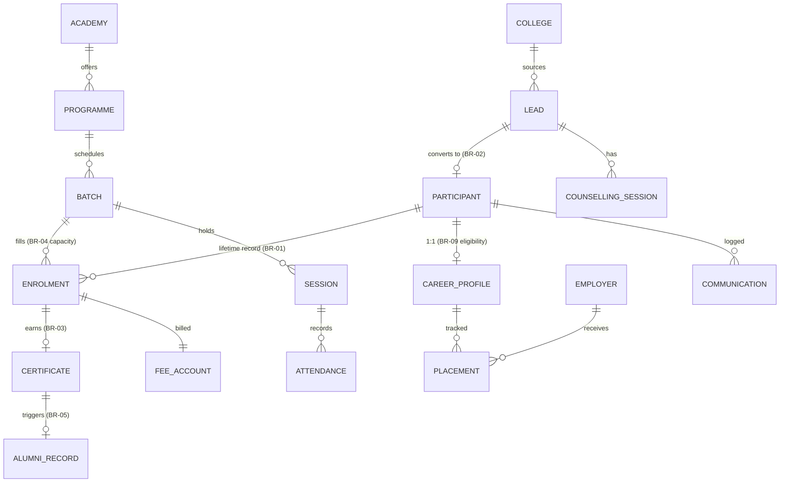

# 03 — Database Blueprint (Firestore)

**TerraNext Business OS · Architecture Blueprint**
Implements: BR-01…BR-09, FR-01…FR-10 · Master Doc Phase 06 entities

---

## 0. Global Conventions (apply to every document)

Every document carries a **base envelope**:

```ts
interface BaseDoc {
  schemaVersion: number;        // versioning strategy §7
  branchId: string;             // tenancy — "HQ" until multi-branch (Doc 12)
  createdAt: Timestamp;
  createdBy: string;            // auth UID ("system" for Functions/triggers)
  updatedAt: Timestamp;
  updatedBy: string;
  deletedAt: Timestamp | null;  // soft delete §5
  deletedBy: string | null;
}
```

- Field names camelCase; enums are string literals (readable in console/exports).
- Doc IDs: auto-IDs except where the ID is a business key (`users` = auth UID, `settings/*` = fixed keys, attendance = participantId).
- Money stored as **integer paise** (`amountPaise: number`) — never floats.
- Phone stored E.164 (`+91…`) — this is the dedupe key (FR-01.4).
- Denormalized display fields (e.g. `participantName` on a payment) are allowed for list rendering, always suffixed with the source (`participantName`, `programmeName`) and refreshed by the owning feature's update path.

## 1. Complete Collection Design

### 1.1 Platform

**`users/{uid}`** — staff profile, mirrors Auth custom claims
```ts
{ displayName, email, phone, role: StaffRole, status: 'active'|'disabled',
  assignedBatchIds: string[],        // Trainer scoping (RBAC row-level)
  photoUrl: string|null, lastLoginAt: Timestamp|null }
```

**`settings/{key}`** — fixed docs: `roles` (permission map, Doc 04), `general` (org info), `idFormats`, `notificationTemplates` (Phase 10 later)

**`counters/{name}`** — transactional sequences: `participantId`, `certificateNo`, `receiptNo`
```ts
{ current: number, prefix: string, year: number }   // reset per fiscal year for receipts
```

**`auditLogs/{id}`** — §6.

**Login-security ledger (ADR-013, server-only, Admin-SDK writes, explicit deny-all rules):**
`loginSecurity/{sha256(normalizedEmail)}` — `{ emailHash, failedAttempts, lastFailedAt, lockedUntil, lastSuccessfulLogin, lastLoginIp, lastUserAgent }` (transactional; no plain emails) ·
`loginAttempts/{id}` — per-attempt access-log register (SOP 17.16): `{ at, email, emailHash, success, ip, userAgent, reason }`, append-only ·
`securityEvents/{id}` — `{ at, type: 'LOGIN_LOCKOUT'|…, severity, emailHash, ip, userAgent, details }`, append-only. Field detail: Doc 14 §4b.

### 1.2 Catalogue

**`academies/{id}`** — `{ name, slug, description, status: 'active'|'archived' }`

**`programmes/{id}`** — `{ academyId, name, code, durationDays, sessionCount, eligibility, curriculumSummary, certificateRules: { minAttendancePct, minAssessmentScore }, feePlanDefault: { totalPaise, installments: {label, amountPaise, dueOffsetDays}[] }, status }`
> `certificateRules` per programme is what makes BR-03 configurable, not hardcoded.

**`batches/{id}`** — `{ programmeId, academyId, code, startDate, endDate, capacity, enrolledCount, trainerUid, schedule: { days: string[], startTime, endTime }, status: 'planned'|'running'|'completed'|'cancelled' }`
> `enrolledCount` maintained transactionally with allocation — BR-04 check is `enrolledCount < capacity` inside the same transaction.

### 1.3 Acquisition

**`leads/{id}`**
```ts
{ name, phone, email: string|null,
  source: 'website'|'campaign'|'referral'|'college'|'walk-in'|'social',
  sourceDetail: { campaignId?, collegeId?, campusLeaderId?, referrerParticipantId? },
  programmeInterestId: string|null, academyId: string|null,
  stage: 'new'|'contacted'|'counselling_booked'|'counselling_attended'
        |'hot'|'admitted'|'lost'|'follow_up',
  assignedToUid: string|null,
  nextFollowUpAt: Timestamp|null, lostReason: string|null,
  participantId: string|null,          // set on conversion; lead is never deleted
  consent: { given: boolean, at: Timestamp, textVersion: string } }
```
Subcollection **`leads/{id}/activities/{id}`** — `{ type: 'call'|'note'|'stage_change'|'followup', summary, at, byUid }` (the follow-up trail, SOP 15.x).

**`counsellingSessions/{id}`** — `{ leadId, consultantUid, heldAt, mode: 'in_person'|'phone'|'video', notes, needsAssessment, recommendation: { programmeId, remarks } | null, outcome: 'recommended'|'not_suitable'|'follow_up' }`
> BR-02: `convertLead` refuses unless a session with `outcome: 'recommended'` and non-null `recommendation` exists for the lead.

**`colleges/{id}`** — `{ name, city, contactPerson, phone, status }` with subcollection **`campusLeaders/{id}`** — `{ name, phone, participantId|null, active }`.

### 1.4 Participant Core (the Lifetime Record)

**`participants/{id}`** — id = generated Participant ID (e.g. `TNX-2026-00042`)
```ts
{ leadId,                                 // provenance; one lead → one participant
  personal: { fullName, dob, gender, phone, email, address,
              emergencyContact: { name, phone, relation } },
  family:   { parentName?, parentPhone?, familyRecordId? },   // parent-first path
  status: 'active'|'completed'|'alumni'|'withdrawn',
  currentEnrolmentId: string|null,
  tags: string[],
  searchTokens: string[] }               // lowercase name/phone prefixes for search
```

Subcollections (the lifecycle stays **under the participant** — one record, many chapters):

- **`enrolments/{id}`** — `{ programmeId, academyId, batchId, enrolledAt, status: 'orientation'|'in_progress'|'completed'|'dropped', attendancePct: number, assessmentSummary: { attempted, passed, avgScore }, certificateId: string|null, completedAt }`
  > BR-01/FR-03.3: re-enrolment = new enrolment doc, **never** a new participant.
- **`timeline/{id}`** — append-only lifecycle events `{ type, refPath, summary, at, byUid }` powering the profile's consolidated timeline (FR-03).
- **`documents/{id}`** — uploaded files metadata `{ kind: 'photo'|'id_proof'|'resume'|'passport'|'other', storagePath, fileName, sizeBytes, contentType, uploadedBy }` (Storage flow: Doc 10 §6).

### 1.5 Academic Delivery

**`batches/{batchId}/sessions/{sessionId}`** — `{ date, topic, trainerUid, status: 'scheduled'|'held'|'cancelled', heldAt }`

**`batches/{batchId}/sessions/{sessionId}/attendance/{participantId}`**
```ts
{ participantId, batchId, programmeId,     // duplicated for collection-group queries
  status: 'present'|'absent'|'late'|'excused', markedBy, markedAt }
```
> Per-participant roll-up: a trigger on attendance writes recomputes `enrolments.attendancePct`. Collection-group index on `participantId` answers "this participant's full attendance history" across batches.

**`assessments/{id}`** — `{ batchId, programmeId, name, maxScore, passScore, heldAt, createdBy }` with subcollection **`scores/{participantId}`** — `{ score, result: 'pass'|'fail', enteredBy, enteredAt }`.

**`certificates/{id}`** — id = certificate number (`TNXC-2026-00107`)
```ts
{ participantId, enrolmentId, programmeId, batchId,
  issuedAt, issuedBy: 'system'|uid,
  criteria: { attendancePct, minRequired, assessmentPassed: boolean },  // BR-03 evidence snapshot
  status: 'issued'|'revoked', revokedReason: string|null,
  verifyHash: string }                    // public verification endpoint (no PII exposed)
```

### 1.6 Career, Placement, Alumni

**`careerProfiles/{participantId}`** — doc ID = participant ID (1:1)
```ts
{ interest: { jobCategories: string[], preferredCountries: string[],
              passportStatus: 'none'|'applied'|'held', willingToRelocate: boolean },
  readinessScore: number|null,
  eligibility: 'not_evaluated'|'not_eligible'|'eligible',   // BR-09: selective, never auto
  eligibilityNote, evaluatedBy, evaluatedAt,
  resumeStatus: 'none'|'draft'|'reviewed'|'final',
  guidanceSessions: — subcollection { heldAt, officerUid, notes, actions } }
```

**`employers/{id}`** — `{ name, country, industry, contact: {name, phone, email}, agreementNote, status }`

**`placements/{id}`** — `{ participantId, employerId, jobCategory, country,
  status: 'under_review'|'shortlisted'|'interview'|'offer'|'placed'|'dropped',
  statusHistory: {status, at, byUid, note}[],
  feeDisclosure: { terranextFeePaise: 0, thirdPartyNotes: string } }`
> `terranextFeePaise` is literally constrained to `0` in rules — BR-08 encoded in the schema.

**`alumniRecords/{participantId}`** — `{ memberSince, triggeredByCertificateId, engagement: { referrals: number, eventsAttended: number }, consentForSuccessStory: boolean }`
> Created by the `onCertificateIssued` trigger (BR-05); manual creation admin-only + audited.

### 1.7 Finance & Communication

**`feeAccounts/{enrolmentId}`** — doc ID = enrolment ID
```ts
{ participantId, programmeId, plan: { totalPaise, discountPaise, discountApprovedBy|null,
  installments: { label, amountPaise, dueDate, status: 'pending'|'paid'|'overdue' }[] },
  paidPaise, balancePaise }
```
Subcollection **`payments/{id}`** — `{ amountPaise, method, receivedAt, receivedBy, receiptNo, note }` — **append-only** (corrections are reversing entries, never edits).

**`communications/{id}`** — `{ channel: 'email'|'sms'|'whatsapp', direction: 'outbound'|'inbound', refType: 'lead'|'participant', refId, templateKey|null, subject, bodyPreview, status: 'queued'|'sent'|'failed', sentAt, byUid|'system' }` (FR-10.3: nothing sent outside the log).

## 2. Relationship Diagram



## 3. Index Strategy

Single-field defaults cover most lookups. Composite indexes (initial `firestore.indexes.json`):

| Collection | Fields | Serves |
|---|---|---|
| leads | `stage ASC, nextFollowUpAt ASC` | follow-up queue |
| leads | `assignedToUid ASC, stage ASC, updatedAt DESC` | "my leads" board |
| leads | `sourceDetail.collegeId ASC, createdAt DESC` | college-wise report |
| leads | `phone ASC` (single) + `email ASC` | dedupe check FR-01.4 |
| batches | `status ASC, startDate ASC` | active batch lists |
| attendance (CG) | `participantId ASC, markedAt DESC` | lifetime attendance |
| attendance (CG) | `batchId ASC, status ASC` | batch absence report |
| enrolments (CG) | `batchId ASC, status ASC` | batch roster |
| placements | `status ASC, updatedAt DESC` | pipeline board |
| feeAccounts | `balancePaise DESC` + installment `dueDate` queries via `plan.installments` denorm field `nextDueDate ASC, balancePaise DESC` | pending-fee report |
| communications | `refType ASC, refId ASC, sentAt DESC` | per-record comm history |
| auditLogs | `entityType ASC, entityId ASC, at DESC` | per-record audit trail |
| auditLogs | `actorUid ASC, at DESC` | per-user activity review |

Rule: every new list screen must name its query + index in the feature's plan **before** implementation; unindexed fan-out queries are rejected in review.

## 4. Soft Delete Strategy

- No document holding participant/lead/financial data is ever hard-deleted (BR-06 spirit + SOP retention registers).
- Delete action ⇒ set `deletedAt`/`deletedBy`; all standard queries filter `deletedAt == null`.
- Security rules **deny `delete`** on all business collections to all clients including admins; only a scheduled retention Function (future, per Record Retention Register) may purge, and it writes a Disposal audit entry first.
- Catalogue entities (academies/programmes/batches) use `status: 'archived'` instead — they are referenced history, not removable data.

## 5. Audit Strategy

**`auditLogs/{id}`**
```ts
{ at: Timestamp, actorUid, actorRole,
  action: 'create'|'update'|'soft_delete'|'status_change'|'permission_change'
         |'login'|'export'|'override',
  entityType: 'lead'|'participant'|'enrolment'|'payment'|…, entityId, entityPath,
  changes: { field: { before, after } } | null,     // diff only, not full snapshots
  context: { feature, reason|null } }
```

- Written by `withAudit()` (client mutations run as a batch: business write + audit write commit together) and by Admin SDK in Functions/actions.
- Rules: `create` allowed for authenticated staff **only when the batch shape is valid** (actorUid == auth.uid); `update`/`delete` denied to everyone — immutable.
- Sensitive reads (exports, financial reports) log an `export` action (SOP 17.16 System Access Log).
- Admin overrides (BR-05 manual alumni, discount approvals) must carry `context.reason` — enforced in rules by requiring the field for `action == 'override'`.

## 6. Versioning Strategy

- `schemaVersion` integer on every doc; current versions registered in `src/types/schema-versions.ts`.
- Readers are **tolerant**: converters upgrade old shapes in memory (`migrate(v, data)`), writers always write latest.
- Backfills: one-off migration Functions, run per-collection, logged to auditLogs as `action: 'migration'` under actor `system`.
- Zod schemas are the source of truth per version; breaking field changes require a new version + migration note in `docs/adr/`.
- Document history for participant/lead records is reconstructed from `auditLogs` diffs — no parallel snapshot collections in phase 1.

## 7. Open Questions for CTO Sign-off

1. Fiscal-year receipt numbering format (assumed `RCP-<FY>-<seq>`).
2. Retention periods per Record Retention Register (SOP 17.16) — needed before the purge Function exists.
3. Whether family linkage (`family.familyRecordId`) becomes a first-class `families` collection in the Parent-first flow milestone — deferred, field reserved.
