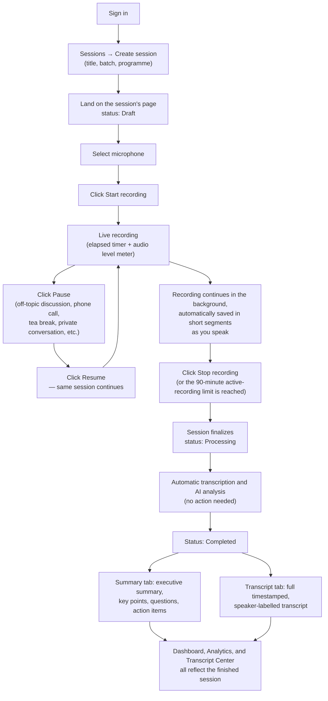
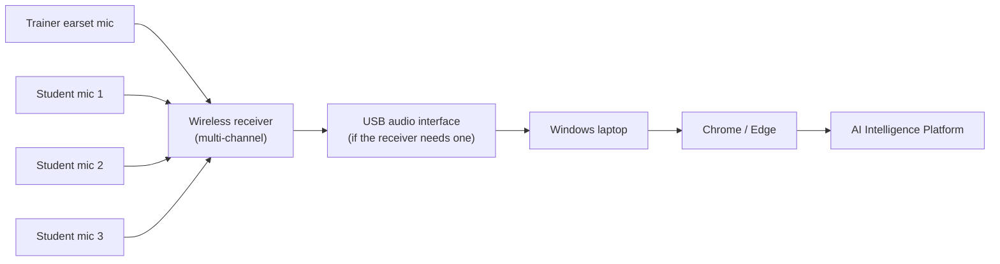
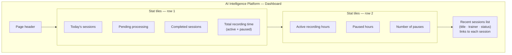
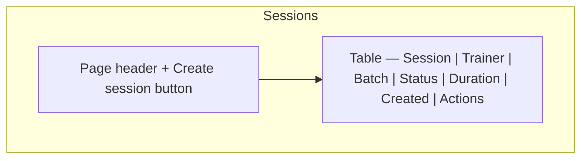
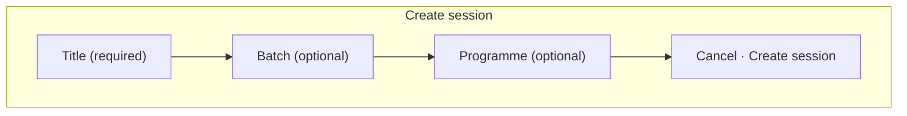
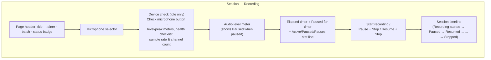
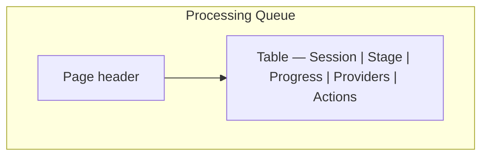
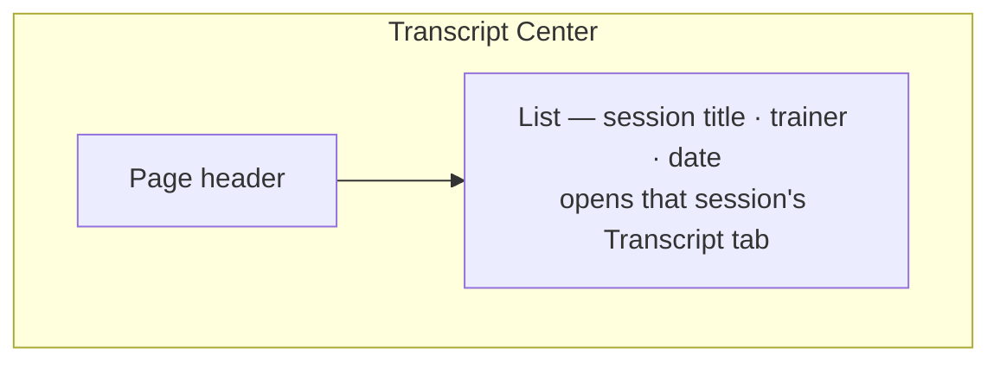
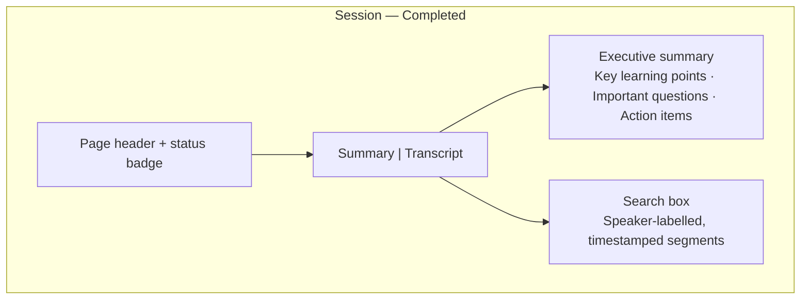
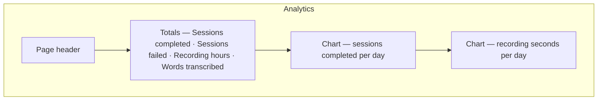

# AI Intelligence Platform — User Guide

**Document version:** 1.2
**Last updated:** 2026-08-05
**Audience:** TerraNext Global Ventures staff with platform access — Trainers, Programme Coordinators, Operations Managers, System Administrators, and Founders
**Related document:** [Administrator Guide](02-administrator-guide.md) (Settings and provider configuration)

> The figures in this guide are annotated screen-layout diagrams that reflect the actual structure of each screen — not photographic screenshots.

---

## 1. AI Platform Overview

The AI Intelligence Platform lets a trainer record a live classroom session from the browser and automatically receive, with no further manual work:

- A full **transcript** of the session, with speakers labelled and timestamps
- An **executive summary** of what was covered
- **Key learning points**, **important questions** raised, and **action items**

### Why it exists

Session content — what was taught, what students asked, what was promised as a follow-up — previously existed only in a trainer's memory or informal notes. The AI Intelligence Platform turns every recorded session into a searchable, reviewable, permanent record, tied to the batch and programme it belongs to.

### What it delivers

- **Zero-effort capture** — a trainer only starts and stops a recording; uploading, transcription, and summarization happen automatically in the background.
- **Searchable transcripts** — every session's spoken content becomes full text you can search.
- **Structured takeaways** — a coordinator can review a 60-minute class in under a minute using the executive summary and key points.
- **Organization-wide visibility** — dashboards and analytics show recording volume and processing activity across all sessions.
- **Long sessions supported** — classroom sessions up to 90 minutes are handled automatically, without any manual splitting or file-size management by the trainer.

### Who can use it

| Role | Can do |
|---|---|
| Founder | Full access — view, record, manage, and configure |
| System Administrator | Full access — view, record, manage, and configure |
| Operations Manager | View sessions, transcripts, and analytics |
| Programme Coordinator | View sessions, transcripts, and analytics |
| Trainer | View, create sessions, record, and retry their own sessions if processing fails |

If your account doesn't have access, the **AI Intelligence Platform** section simply won't appear in your sidebar — contact your System Administrator.

---

## 2. Finding the Platform

Once signed in, look for **AI Intelligence Platform** in the left sidebar. It contains: **Dashboard, Sessions, Processing Queue, Transcript Center, Analytics**, and — for System Administrators and Founders only — **Settings**.

---

## 3. The Complete Workflow

This is exactly what happens, in order, from creating a session to reviewing the finished transcript and summary.

### Step by step

1. **Create a session.** From **Sessions**, click **Create session**, give it a title, and optionally link a batch and/or programme. Submitting takes you straight to the recording screen.
2. **Select a microphone.** Any connected audio device — a laptop's built-in mic, a USB audio interface, a wireless receiver (trainer earset + up to three student mics), or a professional audio mixer — appears automatically in the microphone list, the same way it would in any other browser application. There's nothing to install; see §3.1 below for the full classroom hardware chain.
3. **Check the device (recommended for classroom hardware).** With a device selected, click **Check microphone** to open a short live check — it shows the level and peak meters, a Connected/Signal present/Sample rate/Ready checklist, and (once open) the device's sample rate and channel count. Fix anything it flags — low volume, clipping, no signal, or a disconnected device — before starting. This is optional for a laptop mic but recommended whenever a receiver or mixer is in the signal chain, since a bad gain setting on external hardware is easiest to catch here rather than after a 60-minute recording.
4. **Start recording.** Click **Start recording**. Your browser may ask for microphone permission the first time — allow it. The elapsed timer starts and the audio level bar should move when you or the room speaks. The platform remembers the device you selected for next time, on this browser and computer.
5. **Record.** Sessions can run for up to **90 minutes of active recording**. Pausing for a break doesn't count against that limit — see §5 for the full Pause/Resume workflow.
6. **Pause whenever you need to.** Click **Pause** for an off-topic discussion, a phone call, a tea break, a technical interruption, a private conversation, or while setting up the classroom. No audio is recorded or uploaded while paused. Click **Resume** to continue — it's the same session, not a new one, and you can pause and resume as many times as you need.
7. **Stop recording.** Click **Stop recording** (this works whether you're actively recording or currently paused). The button will briefly show **Saving…** while the last portion of the recording finishes uploading — stay on the page until it does.
8. **Automatic processing.** The moment saving completes, the session status becomes **Processing**. You don't need to do anything else — the page (and the Processing Queue) will update on their own every few seconds.
9. **Review the results.** Once status becomes **Completed**, open the session to see the **Summary** and **Transcript** tabs. Paused time never appears anywhere in the transcript, summary, or analytics — only what was actually said while actively recording is processed.

If a recording reaches the 90-minute active-recording mark, it stops itself automatically with an on-screen notice.

### 3.1 Classroom recording hardware

Beyond a laptop's built-in mic, the platform works with a full classroom audio setup — a trainer's wireless earset plus up to three student mics, feeding a receiver into the laptop:

Whatever reaches the laptop this way — receiver, interface, or mixer — shows up in the microphone list exactly like a built-in mic; the browser doesn't distinguish between them. The platform labels each device with its likely type (USB audio interface, wireless receiver, professional audio mixer, or laptop microphone), guessed from the device's name, purely to help you pick the right one when several are connected — it never restricts which one you can choose. A System Administrator can set which type your organization typically uses in Settings, which only affects which device is pre-selected (see the [Administrator Guide](02-administrator-guide.md#classroom-hardware-mode)).

---

## 4. Every Screen, Explained

### 4.1 Dashboard

**Purpose:** at-a-glance activity and a shortcut into recent sessions.

The top row summarizes today's activity at a glance; the second row breaks total recording time down into active recording versus time spent paused, plus how many pauses happened across all sessions. Below them, the eight most recent sessions are listed with a status badge each; clicking one opens its detail page. This screen updates itself automatically every few seconds, so you'll see new activity without reloading.

### 4.2 Sessions

**Purpose:** the master list of every session, and where you start a new recording.

If you can create sessions, a **Create session** button appears top-right. It opens a short form:

Submitting takes you directly to the recording screen. If you have permission to remove sessions, a delete action appears per row — removing a session hides it from this list; the recording and any transcript or summary already generated are kept, not permanently erased.

### 4.3 Recording screen (session detail)

**Purpose:** everything about one session — recording controls, live processing status, and final results, all in one place.

- While the session is **Draft**, the recorder controls above are shown, including **Device check** — see §3.1.
- Once recording, the recording indicator shows 🟢 **Recording**; clicking **Pause** switches it to 🟡 **Paused** and swaps the button for **Resume**. Before Start (and again once fully stopped), it shows ⚪ **Stopped**.
- While recording, the audio level meter also shows a peak reading and a brief warning if the input is too quiet, silent, or clipping — the same checks the pre-recording device check runs.
- While paused, the audio level meter shows a static **Paused** state instead of moving — nothing is being captured. Elapsed time stops advancing; a separate "Paused for…" timer shows how long the current pause has run.
- The **Session timeline** card lists every lifecycle event for the session — Recording Started, each Paused/Resumed pair, and Recording Stopped — once the session has actually started recording.
- While **Processing**, a notice explains that transcription and AI analysis are running automatically — the page refreshes itself, no action needed.
- Once **Completed**, the recorder is replaced by two tabs — see §4.6 below. If the session was paused at all, a card above the tabs shows how many times, and for how long in total.

### 4.4 Processing Queue

**Purpose:** live visibility into every session currently being transcribed and analyzed.

Each row shows which stage a session is at (see §6 for the full list) and a progress bar. If a job has failed, a **Retry** button appears for the trainer who owns it (and for System Administrators/Founders on any job) — clicking it picks up right where processing left off, rather than starting over.

### 4.5 Transcript Center

**Purpose:** a quick way to find and open any session that has a finished transcript.

This page is a jump-list only — the transcript text itself is read on the individual session's Transcript tab (§4.6).

### 4.6 Session results — Summary and Transcript tabs

Once a session is **Completed**, its page shows two tabs:

**Summary tab** — four cards:
- **Executive summary** — a narrative paragraph describing the session.
- **Key learning points** — the main takeaways.
- **Important questions** — questions raised during the session.
- **Action items** — follow-ups identified from the discussion.

If the AI didn't identify anything for a given list, it shows "None identified." rather than being left blank.

**Transcript tab:**
- A search box lets you find any word or phrase spoken in the session — type to filter, clear to see everything again.
- Each line shows a timestamp, a speaker label (**Trainer**, **Student**, or **Unknown speaker**), and the spoken text.
- Timestamps are for reference; there is no audio playback on this screen.

### 4.7 Analytics

**Purpose:** organization-wide activity over the last 30 days.

Four running totals plus two simple daily charts. Hover a bar to see its exact date and value.

### 4.8 Settings

Settings is available to System Administrators and Founders only — see the [Administrator Guide](02-administrator-guide.md#4-settings).

---

## 5. Recording a Session — Step by Step

1. Go to **Sessions → Create session**, enter a title, optionally choose a batch/programme, and submit.
2. On the recording screen, confirm the correct microphone is selected in the dropdown.
3. Click **Start recording** and accept the browser's microphone permission prompt if asked.
4. Speak normally. Watch the audio level bar — it should move when there's sound in the room. If it stays flat, double-check the selected device.
5. Need a break? Click **Pause**. The indicator turns 🟡 **Paused**, the timer freezes, and the audio level meter shows **Paused** instead of moving — nothing is being recorded or uploaded. Handle the interruption (a phone call, a tea break, a private conversation, classroom setup, anything off-topic), then click **Resume** to continue the *same* session exactly where you left off. Pause and resume as many times as the session needs.
6. When the session is finished, click **Stop recording** — this works whether you're actively recording or currently paused — and wait for **Saving…** to complete before navigating away.
7. You're automatically taken to the processing view. From here, you can leave the page — processing continues in the background and the session will show as **Completed** once ready. The transcript, summary, and analytics will reflect only the time you were actively recording — paused stretches never appear anywhere in the results.

---

## 6. Understanding Session & Processing Status

### Session status

| Status | Meaning |
|---|---|
| Draft | Session created, recording hasn't started |
| Recording | Actively capturing audio |
| Paused | Recording temporarily stopped by the trainer — no audio is being captured; click Resume to continue the same session |
| Processing | Recording finished; transcription and AI analysis running |
| Completed | Transcript and summary are ready to view |
| Failed | Processing hit an error — see the Processing Queue for detail |

### Processing stage (shown on the Processing Queue)

| Stage | Meaning |
|---|---|
| Queued | Waiting to begin |
| Transcribing | Converting the recording to text, segment by segment |
| Merging transcript | Combining all segments into one session transcript |
| AI analysis | Generating the executive summary, key points, questions, and action items |
| Saving | Writing the final results |
| Completed | Finished |
| Failed | An error occurred — see the message shown on that row |

---

## 7. Troubleshooting

| What you're seeing | What it means | What to do |
|---|---|---|
| Microphone list is empty, or only shows "Microphone 1" | Your browser hasn't been granted microphone permission yet | Click **Start recording** (or **Check microphone**) to trigger the permission prompt, and allow it |
| Audio level bar never moves while recording | The wrong device is selected, the mic is muted, or a wireless device lost connection | Select the correct device before starting; check your device's mute switch |
| Device check says "No audio signal detected" | The selected device is open but nothing is reaching it — muted, wrong channel on a multi-channel receiver, or a dead battery on a wireless mic | Confirm the mic is on, unmuted, and paired to the right receiver channel; swap the battery if it's wireless |
| Device check or the recording-time meter warns "Input is clipping" | The gain on the receiver, interface, or mixer is set too high — the recording will sound distorted | Lower the gain on that hardware (not in the browser — there's no in-app gain control) and check again |
| Device check or the recording-time meter warns "Audio level is very low" | Gain is set too low, or the mic is too far from whoever's speaking | Raise the hardware's gain, or move the mic closer |
| "Sample rate is unusually low for speech transcription" on the device check | An unusual device driver setting — rare on standard classroom hardware | Try a different USB port, or check the device's own control software/app if it has one |
| "Recording segment couldn't be saved — check your connection" | A short network interruption prevented part of the recording from uploading | Check your internet connection; if it keeps happening, try a more stable connection |
| A message asking you to contact support instead of re-recording | Part of the recording didn't finish saving when you clicked Stop | **Do not** delete the session or start over — contact a System Administrator; the portions that did save are safely stored |
| Browser tab was closed or the browser crashed mid-recording, or while paused | The recording (or pause) in progress cannot be resumed from where it left off — Pause/Resume only works in the tab where you clicked Start | Start a new session; ask a System Administrator to check the interrupted one. Anything already uploaded before the interruption is safely stored |
| Clicking Pause or Resume shows an error toast instead of switching state | A brief network interruption reached the server before the click could be confirmed, or the session was already in that state (e.g. a double-click) | Try the click again — the recording is unaffected either way; nothing is lost by retrying |
| "The microphone is no longer connected" while trying to Resume | A wireless mic, USB interface, or lapel mic disconnected while the session was paused | Reconnect the device if possible; otherwise click Stop — everything captured before the disconnect is safely saved — and start a new session |
| A session has been on "Processing" for a while | Normal for longer recordings — each segment is transcribed in turn, not all at once | Check the Processing Queue for the current stage; only take action if the stage shows **Failed** |
| A processing job shows **Failed** | The AI transcription or analysis step hit an error (shown under the stage) | Click **Retry** if you own the session, or ask a System Administrator |
| No **Retry** button on a failed job | You don't own that session | Ask the trainer who recorded it, or a System Administrator |
| A page says you're not authorized | Your role doesn't have access to that screen | Ask a System Administrator to confirm your access |
| A completed session's summary/transcript looks generic or placeholder-like | AI processing isn't fully configured yet on your organization's account | Ask a System Administrator — see the [Administrator Guide](02-administrator-guide.md#5-ai-provider-setup) |

---

## 8. Frequently Asked Questions

**Can I pause a recording and resume it later?**
Yes. Click **Pause** for any interruption — an off-topic discussion, a phone call, a tea break, a technical issue, a private conversation, or classroom setup — and click **Resume** to continue the same session exactly where you left off. No audio is captured or uploaded while paused, and you can pause and resume as many times as one session needs. Paused time never appears in the transcript, summary, or analytics.

**What's the maximum length of a session?**
90 minutes of **active recording**. The recorder stops itself automatically if you reach that limit. Time spent paused doesn't count toward it — a session with several breaks can run much longer in wall-clock time and still only use 90 minutes of the active-recording budget.

**Do I need any special recording hardware?**
No — a laptop's built-in mic works. For a full classroom setup (trainer + up to three students), the platform also supports a wireless receiver and USB audio interface chain — see §3.1. Any device your computer recognizes as an audio input works automatically; the platform uses the same list as any other application on your computer.

**What does the device label next to each microphone mean (e.g. "— Wireless receiver")?**
The platform guesses each device's type from its name, purely to help you tell them apart when several are connected — it's a label, not a restriction. You can still select any device regardless of its guessed type.

**Can I see other trainers' sessions?**
If your role has view access to the AI Intelligence Platform, you can see all sessions across the organization, not only your own. This is a shared, organization-wide record.

**Can I edit the transcript or summary?**
Not from this screen today. If something looks wrong, contact a System Administrator.

**What happens if I delete a session?**
It disappears from the Sessions list, but the recording, transcript, and summary already generated are kept — it isn't permanently erased.

**Why does the search box on the Transcript tab only search text, not speakers?**
The current search searches spoken text only. There's no separate "filter by speaker" control on this screen today.

**How long is my session's audio kept?**
Your organization's System Administrator sets a retention policy in Settings — check with them for your organization's current practice.

**Will I get notified when my session finishes processing?**
Check with your System Administrator about whether notifications are enabled for your organization.
