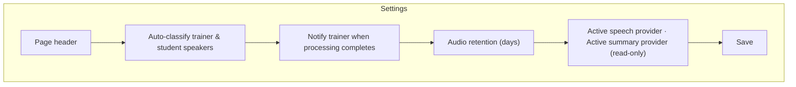

# AI Intelligence Platform — Administrator Guide

**Document version:** 1.1
**Last updated:** 2026-08-03
**Audience:** System Administrators and Founders — the roles that configure and manage this platform
**Related document:** [User Guide](01-user-guide.md) (day-to-day operation)

> The figures in this guide are annotated screen-layout diagrams that reflect the actual structure of each screen — not photographic screenshots.

---

## 1. Administrator Responsibilities

As a System Administrator or Founder, you are responsible for:

1. **Turning on real AI transcription and summarization** (§5) — until configured, the platform completes sessions with placeholder text instead of real content.
2. **Understanding who can see and do what** (§2).
3. **Managing the operational settings** on the Settings screen (§4).
4. **Removing sessions** that should no longer appear in the active list (§3).
5. **Retrying** any failed processing job, for any trainer (§6).
6. **Monitoring** the Processing Queue and Analytics screens for overall platform health (§7).

---

## 2. Roles & Access

| Role | View sessions/transcripts/analytics | Create sessions & record | Remove sessions | Change Settings |
|---|:---:|:---:|:---:|:---:|
| Founder | ✅ | ✅ | ✅ | ✅ |
| System Administrator | ✅ | ✅ | ✅ | ✅ |
| Operations Manager | ✅ | — | — | — |
| Programme Coordinator | ✅ | — | — | — |
| Trainer | ✅ | ✅ (own sessions only) | — | — |
| Transformation Consultant, Finance Officer, Career & Placement Officer | — | — | — | — |

Notes on how access works in practice:

- A trainer can only record against sessions they themselves created — there's no "record on behalf of another trainer" capability. The same rule covers Pause/Resume — only the session's owner can pause or resume it.
- A trainer can retry their own failed processing jobs; System Administrators and Founders can retry anyone's.
- Anyone with view access can see **every** session across the organization, not only their own branch or their own sessions — this is a shared, organization-wide record by design.
- Removing a session is limited to System Administrators and Founders; trainers cannot remove their own sessions. This includes a session left "stuck" in **Recording** or **Paused** because its browser tab was closed — deleting it hides it from the active list without losing whatever was already captured.

---

## 3. Managing Sessions

From **Sessions**, System Administrators and Founders can remove any session using the delete action in its row. This:

- Hides the session from the active Sessions list.
- **Keeps** the recording, transcript, and summary — nothing is permanently deleted.
- Does **not** change the session's processing status.

There is no bulk-remove and no "restore" button in the interface — if a session needs to be restored after removal, contact your technical support team.

Every meaningful change — creating a session, finishing a recording, removing a session, changing Settings, or retrying a job — is recorded in the organization's audit log with who did it and when.

---

## 4. Settings

Available at **AI Intelligence Platform → Settings**, visible only to System Administrators and Founders.

| Setting | What it controls |
|---|---|
| **Auto-classify trainer & student speakers** | When on, the platform attempts to label each part of the transcript as Trainer or Student speech. When off, transcript segments are left unlabelled until reviewed manually. |
| **Notify trainer when processing completes** | Governs whether trainers receive a completion notification. Confirm with your technical team whether notification delivery is active for your organization before relying on it. |
| **Audio retention (days)** | Records your organization's intended retention period for session audio (7–3650 days). Confirm with your technical team whether automatic deletion is active for your organization — this field records policy intent, and you should not assume audio is automatically purged without checking. |

Two fields are shown for information only and can't be edited here: **Active speech provider** and **Active summary provider** — these show which AI provider actually processed the most recently completed session. If you've just changed provider configuration, these badges update after the next session finishes, not immediately.

---

## 5. AI Provider Setup

This is the most important setup task for a new deployment: **without configuration, sessions still complete end to end, but with placeholder transcript and summary text instead of real content.**

### 5.1 Default state

Out of the box, the platform runs in a safe demonstration mode. Every session records, uploads, and "processes" successfully, but the transcript and summary will contain a message explaining that a real AI provider hasn't been set up yet. This lets you test and demonstrate the full workflow — recording, uploading, the processing queue, the Completed state — before committing to a provider.

### 5.2 Enabling real transcription

Turning on real AI processing is a one-time technical configuration step, done by your technical/engineering team on the hosting platform (not from any screen inside the CRM) — for security, the AI service credentials are never entered into or stored in the CRM interface itself. Your technical team will need to know:

- An **OpenAI** account and API key — it is the only supported real provider.

Once configured, the **Active speech/summary provider** badges on the Settings screen (§4) will confirm the provider is running after the next session completes.

---

## 6. Managing the Processing Queue

As an administrator, you can retry **any** failed job — not just those you created yourself. Retrying:

1. Only applies to jobs that have actually **Failed**.
2. Picks up processing from wherever it stopped — segments already successfully transcribed are not redone.
3. Is logged in the audit trail.

There is no bulk "retry all" action today — each failed job is retried individually. There's also no automatic retry — a failed job stays failed until someone clicks Retry.

---

## 7. Where to Look When Something Is Wrong

| Symptom | Where to check | What you'll find |
|---|---|---|
| A session is stuck on Processing for a long time | Processing Queue, that session's row | The exact stage it's at; longer recordings naturally take longer since each segment is processed in turn |
| A job shows Failed | Same row | The specific error message explaining what went wrong |
| Provider badge on Settings still shows the demonstration mode after configuring a real provider | Confirm with your technical team that the API key was entered correctly | A misconfigured key falls back to demonstration mode without a separate error message anywhere in the CRM |
| You need a record of who removed/retried/changed something | Ask your System Administrator to check the audit log | Every meaningful change is recorded with who did it and when |
| A session is stuck showing **Paused** (or **Recording**) with no activity | The trainer's browser tab was closed or refreshed while the session was in progress — Pause/Resume/Stop only work from the tab where recording was started | Anything already uploaded is safely stored; remove the session per §3 if it's no longer relevant — the audio, transcript, and summary already generated are kept |

**Note on Pause/Resume:** pausing never uploads or captures audio, and paused time is automatically excluded from the transcript, summary, and every AI-generated output — there is nothing to configure for this. The Dashboard's "Paused hours" and "Number of pauses" tiles are informational only.

---

## 8. Frequently Asked Questions

**Do I need to buy separate hardware for recording?**
No. Any microphone the trainer's computer already recognizes works — USB interfaces, wireless lapel mics, boundary conference mics, or a laptop's built-in mic.

**How much does AI processing cost per session?**
This depends on OpenAI's current transcription/summarization pricing. Ask your technical team for a current estimate based on your expected recording volume.

**Can I limit which trainers can record sessions?**
Recording access follows the role assignments in §2 — any Trainer, System Administrator, or Founder can create and record sessions. There's no per-trainer allow-list beyond role assignment.

**Can I restrict who sees a given session?**
Not today — anyone with view access to the AI Intelligence Platform can see every session across the organization.

**What happens to a session's audio if I lower the retention setting?**
Confirm with your technical team what retention enforcement is currently active for your deployment before changing this value, so you understand the practical effect.

**Can I export a transcript or summary to a file?**
Not from the current screens — check with your technical team about export options for your organization.

**Who do I contact for AI provider billing or API key issues?**
Your technical/engineering team manages the AI provider account and API key configuration — they are your first point of contact for provider-side billing or key issues.
