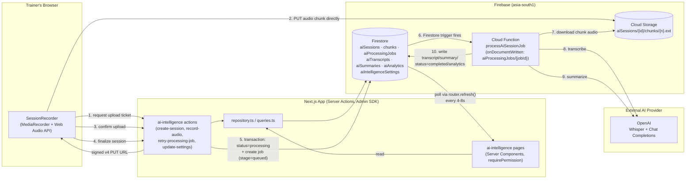
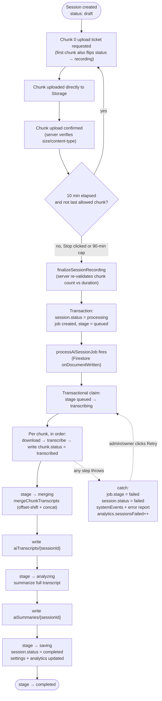
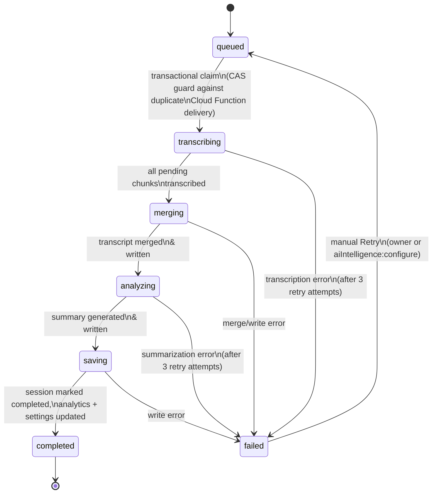
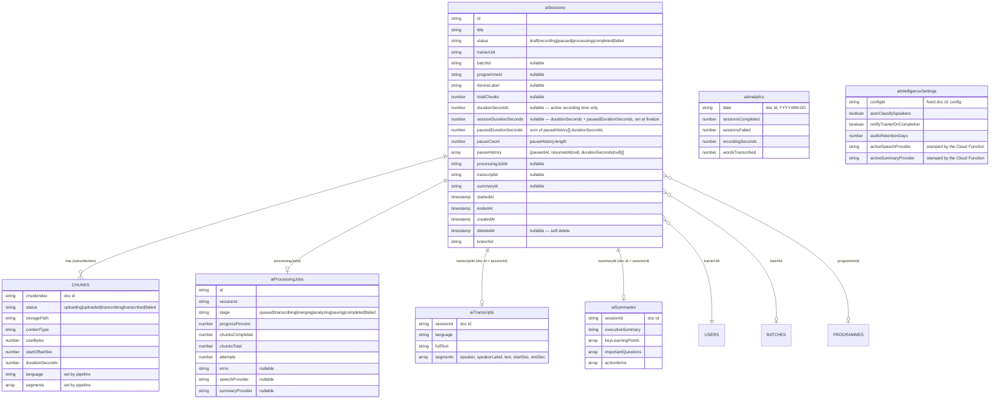
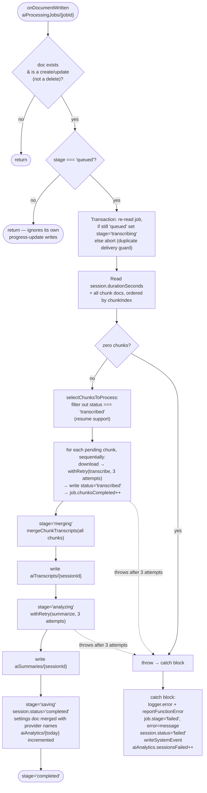

# Engineering 01 — AI Intelligence Platform: Technical Architecture Guide

**Document version:** 1.2
**Last reviewed:** 2026-08-03
**Audience:** Architects, senior engineers
**Companion documents:** [02 — Developer Guide](02-developer-guide.md) · [03 — API & AI Workflow Guide](03-api-workflow-guide.md) · [04 — Known Limitations & Engineering Notes](04-known-limitations-and-engineering-notes.md)

Every diagram and claim below is derived from the current implementation, not a design intent. Implementation gaps, trade-offs, and forward-looking notes are deliberately kept out of this document — they are consolidated in [04 — Known Limitations & Engineering Notes](04-known-limitations-and-engineering-notes.md), referenced by ID (e.g. **L1**, **P2**, **R1**) wherever relevant below.

---

## 1. Module boundary and code layout

The module is a self-contained "feature" following the repo's standard feature-slice pattern (Doc 02), plus a small Cloud Functions package for the parts of the pipeline that must run server-side, unattended, and outside the request/response lifecycle of the web app.

```
src/features/ai-intelligence/
  schema.ts            — Zod schemas, constants, TypeScript read-model types
  logic.ts             — pure functions (chunk planning, storage paths, labels, formatting)
  repository.ts        — all Firestore reads/writes (Admin SDK)
  queries.ts           — read-only query façade used by Server Components (pages)
  actions/             — 'use server' mutations (create, delete, record-audio, retry, settings)
  components/          — client + server UI components
  index.ts             — the only import surface other code is meant to use

src/app/(app)/ai/       — 7 Next.js pages (thin: permission check + data fetch + render)

functions/src/ai/
  process-session-job.ts     — the one Cloud Function (Firestore trigger)
  chunk-pipeline.ts          — pure merge/selection logic, unit-tested independently
  retry-with-backoff.ts      — generic retry helper
  providers/                 — provider abstraction (types, factory, mock, openai, json)
```

Everything outside `src/features/ai-intelligence/index.ts`'s exports is private to the module by convention (lint-enforced import boundaries per Doc 02). The Next.js app and the Cloud Functions package never call each other directly — they communicate exclusively by writing and watching Firestore documents.

---

## 2. System architecture



### Key architectural facts

- **No client-side Firestore SDK reads.** "Live" UI updates are implemented via a client component (`AutoRefresh`) calling `router.refresh()` on a `setInterval`, not `onSnapshot` realtime listeners (see **L10**).
- **Every Firestore write to an AI collection is `allow write: if false`.** All writes happen exclusively through the Admin SDK: Next.js Server Actions (`adminDb()`) or the Cloud Function. No browser can write directly to any AI collection, regardless of role.
- **Audio never passes through the Next.js server.** The browser uploads chunks directly to Cloud Storage via a short-lived (30-minute) v4 signed URL minted by a server action.
- **The Next.js app and the Cloud Function never call each other's code.** The only coupling is the `aiProcessingJobs` collection: the app creates a job document with `stage: 'queued'`; the function's Firestore trigger reacts to that write. Either side could be redeployed or rewritten independently as long as the job/session document contract is preserved.

---

## 3. Workflow diagram (end to end)



---

## 4. Sequence diagram — one full session

```mermaid
sequenceDiagram
    participant U as Trainer (Browser)
    participant A as Server Actions
    participant S as Cloud Storage
    participant F as Firestore
    participant CF as Cloud Function\n(processAiSessionJob)
    participant P as AI Provider\n(OpenAI)

    U->>A: createSession(title, batchId?, programmeId?)
    A->>F: create aiSessions/{id} (status=draft)
    A-->>U: sessionId → redirect to session page

    loop every ~10 minutes, per chunk
        U->>A: requestChunkUploadTicket(sessionId, chunkIndex, ...)
        A->>F: reserve chunks/{n} (status=uploading)
        A-->>U: signed v4 PUT URL (30 min TTL)
        U->>S: PUT audio blob directly
        U->>A: confirmChunkUpload(sessionId, chunkIndex, duration)
        A->>S: verify object exists, size & contentType match
        A->>F: chunks/{n}.status = uploaded
    end

    U->>A: finalizeSessionRecording(sessionId, totalChunks, totalDuration)
    A->>A: planSessionChunks() re-derives expected chunk count
    A->>F: transaction: session.status=processing, create job (stage=queued)
    F--)CF: onDocumentWritten trigger fires
    CF->>F: transaction claim: stage queued→transcribing
    loop each pending chunk, sequential
        CF->>S: download chunk audio
        CF->>P: transcribe(audioBuffer, contentType)
        P-->>CF: text + segments
        CF->>F: chunks/{n}.status=transcribed; job.chunksCompleted++
    end
    CF->>CF: mergeChunkTranscripts (offset-shift + concat)
    CF->>F: write aiTranscripts/{sessionId}; job.stage=merging→analyzing
    CF->>P: summarize(mergedText)
    P-->>CF: executiveSummary, keyLearningPoints, importantQuestions, actionItems
    CF->>F: write aiSummaries/{sessionId}; job.stage=saving
    CF->>F: session.status=completed; settings + analytics updated
    CF->>F: job.stage=completed

    U->>A: (page auto-refresh) getSessionDetail(sessionId)
    A->>F: read session + transcript + summary
    A-->>U: render Summary / Transcript tabs
```

Chunks are transcribed strictly sequentially, not concurrently — see **R1**.

---

## 5. Processing pipeline (stage state machine)



`progressPercent` shown in the UI is a fixed mapping, not a continuous measure: `queued=0, transcribing=15, merging=60, analyzing=70, saving=90, completed=100, failed=0` (the failed state resets the bar rather than freezing it at its last value).

---

## 6. Database diagram



Full field-by-field detail (exact types as coded) is in [02 — Developer Guide §3](02-developer-guide.md#3-data-model--exact-field-reference).

---

## 7. Cloud Function internal flow



Config on this function: `secrets: [OPENAI_API_KEY]`, `memory: '1GiB'`, `timeoutSeconds: 540` (9 minutes), region `asia-south1` (global default, `maxInstances: 10`). See **R2**, **R3**, **R4** for the performance implications of this configuration.

---

## 8. Recording flow (client-side state machine)

```mermaid
stateDiagram-v2
    [*] --> idle
    idle --> recording: Start recording\n(getUserMedia + MediaRecorder.start(1000ms))
    recording --> recording: every 10 min of *active* recording — rollover:\nstop current MediaRecorder,\nimmediately start a new one\non the same MediaStream
    recording --> paused: Pause clicked\n(pauseSessionRecording server action,\nthen MediaRecorder.pause() —\nsame chunk, no rollover)
    paused --> recording: Resume clicked\n(resumeSessionRecording server action,\nthen MediaRecorder.resume();\nrollover/max-duration timers re-armed\nfor their remaining time)
    recording --> uploading: Stop clicked, or\n90-min active-recording cap reached
    paused --> uploading: Stop clicked while paused\n(MediaRecorder.stop() is valid from 'paused' too;\nfinalizeSessionRecording closes\nany trailing open pause event)
    uploading --> completed: all chunk uploads\nresolved successfully\n(finalizeSessionRecording called)
    uploading --> error: any chunk failed\nall 3 upload attempts
    error --> [*]: no automatic recovery —\nsession left in 'recording'/'paused' status
    completed --> [*]
```

The recorder does not use one continuous `MediaRecorder` instance for the whole session. It deliberately stops and restarts a new `MediaRecorder` on the same `MediaStream` at each 10-minute (of active recording) boundary, because concatenated `ondataavailable` blobs from one continuous recorder are not independently decodable audio files, while stop/restart produces genuinely independent, valid files per chunk — at the cost of a sub-100ms audio gap at each boundary. The last allowed chunk (index 8, the 9th chunk) receives no rollover timer of its own, only the whole-session 90-minute cap or a manual Stop — this avoids a rollover and the auto-stop firing in the same instant and producing a 10th, over-the-limit chunk. See **L9** for what happens if the tab closes mid-recording or mid-pause.

### 8.1 Pause/Resume (Production-Grade Pause / Resume Recording)

Pause/Resume is deliberately layered on top of the existing chunk architecture rather than replacing any part of it:

- **Pausing uses `MediaRecorder.pause()`/`.resume()` on the current chunk's recorder** — not a new chunk boundary. A trainer may pause many times in one session (phone call, tea break, private conversation, classroom setup); treating every pause as a chunk finalize/re-upload would risk exceeding `MAX_CHUNKS_PER_SESSION` (9) on a session with several short pauses. Native pause/resume produces **zero** extra chunks, uploads, or `requestChunkUploadTicket` calls of any kind — `record-audio.ts`'s ticket/confirm actions are completely unchanged by this feature.
- **The browser excludes paused audio from the encoded output entirely** (it is not silence spliced in — it is genuinely absent from the container), so paused periods are structurally incapable of reaching transcription, summarization, or analytics. `processAiSessionJob` and `chunk-pipeline.ts` required **no changes** for this guarantee to hold.
- **The rollover timer and the 90-minute max-duration timer are both paused and resumed alongside the recorder** (`session-recorder.tsx`: `rolloverDeadlineRef`/`rolloverRemainingMsRef`, `maxDurationDeadlineRef`/`maxDurationRemainingMsRef`), so both measure *active* recording time, never wall-clock time. A session can be paused for a two-hour lunch break and still only consume 90 minutes of its active-recording budget.
- **Server-first ordering:** the client calls `pauseSessionRecording`/`resumeSessionRecording` and waits for `ok: true` before touching the `MediaRecorder`, so a lost network request during the pause/resume click never leaves the browser and the server disagreeing about session state.
- **Server-authoritative, race-safe bookkeeping:** `markSessionPaused`/`markSessionResumed` (`repository.ts`) run inside a Firestore transaction that checks the session is in the expected state (`recording` for pause, `paused` for resume) before mutating it — a double-click, a second tab, or a retried request after a dropped response all safely no-op rather than double-counting a pause.
- **Stop works from `paused` too.** `MediaRecorder.stop()` is valid from both `recording` and `paused` states, so `handleStopClick` needs no branch on which state it's stopping from. `finalizeSessionRecording`'s status precondition was loosened from `status === 'recording'` to `status === 'recording' || status === 'paused'`, and `finalizeSessionAndEnqueue` closes any trailing open pause event itself (`closeTrailingPauseEvent` in `logic.ts`) so the trainer never has to click Resume before Stop.

---

## 9. Security architecture summary

Full detail in [02 — Developer Guide §5](02-developer-guide.md#5-security-implementation-reference).

- **Firestore:** all 6 AI collections/subcollection are read-gated by role (generated `can_aiIntelligence_view()` and sibling predicates, sourced from the same `ROLE_PERMISSIONS` map that drives the app) and **write-denied to every client unconditionally** (`allow write: if false`). Authorization for who can do what is enforced entirely in the Server Actions, not in rules. See **L1**/**L2** for the scope of what "role-gated" does and does not restrict today.
- **Storage:** `storage.rules` is a single blanket `allow read, write: if false` across the entire bucket, for every path in the app, not just AI audio. All object access goes through server-minted v4 signed URLs whose signature — not a rule — is the authorization.
- **Cloud Function trust model:** `processAiSessionJob` performs no authentication/authorization checks of its own. It relies entirely on being unreachable by any client (it is a Firestore trigger, not an HTTP/callable endpoint) and on the Firestore/Storage rules above blocking any client from forging the job document that triggers it.
- **Audit trail:** every session-lifecycle mutation initiated from the Next.js app (create, finalize/status-change, soft-delete, settings update, job retry) writes an immutable `auditLogs` entry. The Cloud Function itself never writes to `auditLogs` — its failure signal is a separate `systemEvents` collection plus Cloud Error Reporting.

**Note:** Firestore rules for this module are read-gated by role only — they do not scope by branch or by session ownership. Any engineer extending this module should treat that as a deliberate, documented boundary (see **L1**/**L2** in the Known Limitations guide) rather than an oversight to silently "fix" without a corresponding product decision.

---

## 10. Implementation status matrix

| Feature | Status | Detail |
|---|---|---|
| Browser-based recording (any input device) | Implemented | Standard Web Audio/MediaRecorder APIs; no dedicated hardware SDK |
| Pause/Resume recording | Implemented | Native `MediaRecorder.pause()/resume()`, unlimited cycles per session, zero extra chunks; server-authoritative `pauseHistory`/`pauseCount`/`pausedDurationSeconds` |
| Automatic chunking for long sessions | Implemented | 10-minute chunks (of active recording), 90-minute active-recording cap, 9 chunks max |
| Background chunk upload with retry | Implemented | 3 attempts, linear backoff, direct-to-Storage via signed URL |
| Resume an interrupted recording after a crash/reload | Not implemented | **L9** |
| Resume a partially-processed job on retry | Implemented | Skips chunks already marked `transcribed` |
| Live/realtime UI updates | Partial | Polling, not realtime listeners — **L10** |
| Speaker classification (trainer/student) | Implemented | Second, audio-blind chat-completion pass over Whisper's segmented text — **P2** |
| Transcript full-text search | Implemented | Substring filter only — **L11** |
| Transcript filter by speaker | Not implemented | **L11** |
| Jump to timestamp / play audio inline | Not implemented | **L11** |
| Analytics dashboard | Implemented | Fixed 30-day window, 4 totals + 2 bar charts |
| Branch-scoped access control | Not implemented | **L1** |
| Per-trainer session privacy | Not implemented | **L2** |
| Audio retention/auto-purge | Not implemented | **L7** |
| Completion notifications | Not implemented | **L8** |
| Export | Not implemented | **L6** |
| Vendor-agnostic provider interfaces | Implemented | `SpeechProvider`/`SummaryProvider` — OpenAI is the only real implementation today; Mock is the zero-credential fallback |
| Manual job retry | Implemented | Owner or `aiIntelligence:configure`; resumes rather than restarts |
| Bulk/automatic job retry | Not implemented | **L13, L14** |
