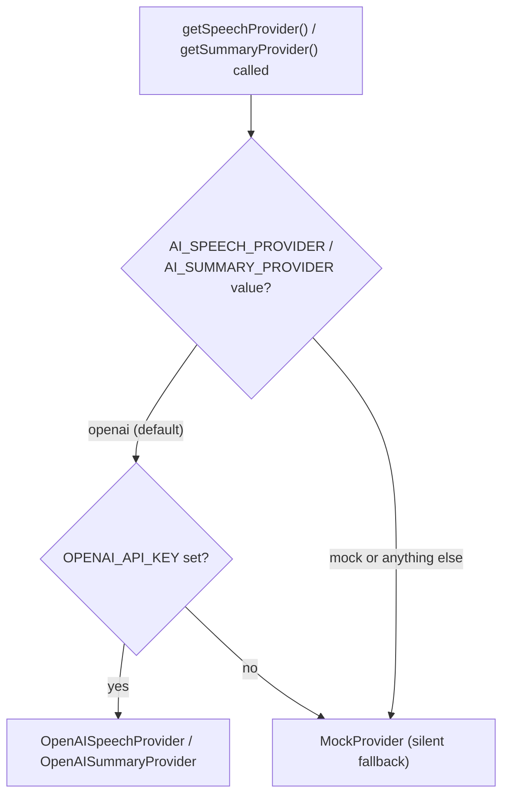
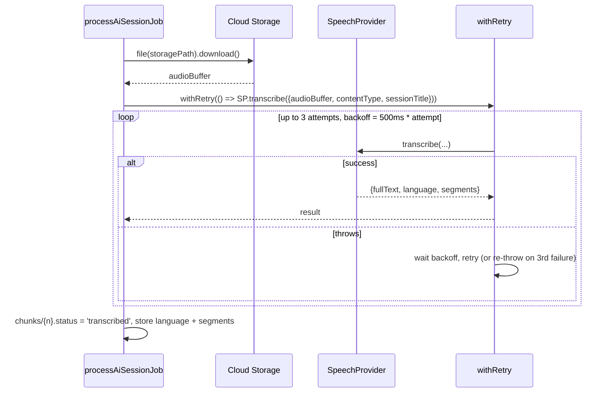

# Engineering 03 — AI Intelligence Platform: API & AI Workflow Guide

**Document version:** 1.2
**Last reviewed:** 2026-08-03
**Audience:** Engineers integrating with, calling, or debugging the module's server actions and the AI provider layer
**Companion documents:** [01 — Technical Architecture](01-technical-architecture.md) · [02 — Developer Guide](02-developer-guide.md) · [04 — Known Limitations & Engineering Notes](04-known-limitations-and-engineering-notes.md)

There is no public REST or callable HTTPS API for this module — every entry point below is a Next.js Server Action (invoked from React, not fetchable as a URL) except the one Cloud Function, which is a Firestore trigger, not an HTTP endpoint. Provider trade-offs, cost/latency implications, and reliability considerations are consolidated in [04 — Known Limitations & Engineering Notes §4](04-known-limitations-and-engineering-notes.md#4-provider-specific-considerations); this document covers the underlying mechanics only.

---

## 1. Provider selection rationale

The module is built against a provider-agnostic interface (`SpeechProvider`/`SummaryProvider`, `functions/src/ai/providers/types.ts`) rather than being hard-wired to one vendor's SDK, even though only one real implementation exists today:

- **OpenAI** — the only real provider. Whisper (`whisper-1`) performs speech-to-text; a separate GPT chat-completion call performs speaker classification, since Whisper itself has no diarization capability.
- **Mock** — the automatic, zero-credential fallback whenever `OPENAI_API_KEY` isn't set, so the full pipeline (queue, stages, retry, dashboard) can be built, tested, and demonstrated with zero API keys and zero cost.

OpenAI is called via raw `fetch` against its REST API — no vendor SDK is installed as a dependency for this module. Gemini support was removed; the interfaces remain vendor-agnostic if another provider is added later.

---

## 2. Server actions — complete contract reference

All actions live under `src/features/ai-intelligence/actions/`, are declared `'use server'`, and return `Promise<Result<T>>` (`{ok: true, data: T} | {ok: false, error: {code, message, fields?}}`). None are reachable as HTTP routes — they are called directly from React Server/Client Components via Next.js's Server Actions transport.

### `createSession`

| | |
|---|---|
| Permission | `aiIntelligence:create` |
| Input | `{ title: string (3-200 chars); batchId?: string (≤120); programmeId?: string (≤120); deviceLabel?: string (≤200) }` |
| Extra validation | `batchId`/`programmeId`, if provided, must reference an existing document (`batchExists`/`programmeExists`) |
| Output | `{ sessionId: string }` |
| Side effects | Creates `aiSessions/{id}` with `status: 'draft'`, `trainerUid = caller`; 1 audit log entry (`create`, `ai_session`) |

### `requestChunkUploadTicket`

| | |
|---|---|
| Permission | `aiIntelligence:create` + caller must be the session's `trainerUid` |
| Input | `{ sessionId; chunkIndex: 0-8; contentType: one of ALLOWED_AUDIO_CONTENT_TYPES; sizeBytes: 1-14,680,064; startOffsetSec: 0-5400 }` |
| State preconditions | chunk 0 requires session `status` in `{draft, recording}`; any other chunk requires `status === 'recording'` |
| Output | `{ sessionId, chunkIndex, uploadUrl (v4 signed PUT URL, 30-min TTL), contentType }` |
| Side effects | Upserts `chunks/{chunkIndex}` (`status: 'uploading'`); if this is chunk 0 of a still-`draft` session, also flips session `status` to `'recording'`. No audit entry (upload plumbing). |

### `confirmChunkUpload`

| | |
|---|---|
| Permission | `aiIntelligence:create` + ownership |
| Input | `{ sessionId; chunkIndex: 0-8; durationSeconds: 1-630 }` |
| State preconditions | session `status === 'recording'`; a chunk reservation must already exist |
| Output | `{ status: 'uploaded' } \| { status: 'failed' }` — **a business-level success response can still carry `status: 'failed'`; callers must check the payload, not just `ok: true`** |
| Side effects | Verifies the actual Storage object's size/content-type against the reservation (deleting the object on mismatch); marks the chunk `uploaded` or `failed` accordingly. No audit entry. |

**Warning:** `confirmChunkUpload` returning `ok: true` does not mean the chunk uploaded successfully — check `data.status` before proceeding. Any client or script calling this action directly (rather than through the existing recorder component) must handle the `{ status: 'failed' }` branch explicitly, or it will silently treat a failed upload as a success.

### `pauseSessionRecording`

| | |
|---|---|
| Permission | `aiIntelligence:create` + ownership |
| Input | `{ sessionId: string }` |
| State preconditions | session `status === 'recording'` (transactionally re-checked in `markSessionPaused` — a double-click or a second tab safely returns `false` → `conflictError`, not a second pause event) |
| Output | `{ status: 'paused' }` |
| Side effects | session → `status: 'paused'`; appends `{ pausedAt: now, resumedAt: null, durationSeconds: null }` to `pauseHistory`; `pauseCount`/`pausedDurationSeconds` recomputed from the array. No audit entry (same high-frequency-plumbing rationale as chunk ticket/confirm — see §2's note on `requestChunkUploadTicket`). No chunk or Storage write of any kind. |

### `resumeSessionRecording`

| | |
|---|---|
| Permission | `aiIntelligence:create` + ownership |
| Input | `{ sessionId: string }` |
| State preconditions | session `status === 'paused'` (same transactional double-click/race guard as pause) |
| Output | `{ status: 'recording' }` |
| Side effects | session → `status: 'recording'`; closes the trailing open `pauseHistory` entry (`resumedAt: now`, `durationSeconds` computed), recomputing `pauseCount`/`pausedDurationSeconds`. No audit entry. No chunk or Storage write — the client resumes the *same* `MediaRecorder`/chunk, it does not start a new one. |

**Client ordering:** the browser calls `pauseSessionRecording`/`resumeSessionRecording` and waits for `ok: true` before touching `MediaRecorder.pause()`/`.resume()`, so a network failure on this call never leaves the browser paused while the server still thinks the session is recording (or vice versa).

### `finalizeSessionRecording`

| | |
|---|---|
| Permission | `aiIntelligence:create` + ownership |
| Input | `{ sessionId; totalChunks: 1-9; totalDurationSeconds: 1-5460 }` |
| State preconditions | session `status === 'recording'` **or** `status === 'paused'` — Stop is valid from either, since `MediaRecorder.stop()` works from both states |
| Extra validation | `planSessionChunks(totalDurationSeconds).length` must equal `totalChunks` (server-independent re-derivation, based on *active* duration only); every chunk `0..totalChunks-1` must exist, be contiguous, and be `status === 'uploaded'` |
| Output | `{ jobId: string }` |
| Side effects | One transaction: closes any trailing open `pauseHistory` entry (Stop-while-paused case) before computing final `pausedDurationSeconds`/`pauseCount`; session → `status: 'processing'`, `totalChunks`, `durationSeconds` (active), `sessionDurationSeconds` (active + paused), `pauseHistory`/`pauseCount`/`pausedDurationSeconds`, `endedAt`, `processingJobId`; creates `aiProcessingJobs/{jobId}` with `stage: 'queued'`. This write is what fires `processAiSessionJob`. 1 audit log entry (`update`, `ai_session`, `status: recording→processing`). |

### `retryProcessingJob`

| | |
|---|---|
| Permission | `aiIntelligence:update` + (session owner OR `aiIntelligence:configure`) |
| Input | `{ jobId: string }` |
| State preconditions | job `stage === 'failed'` (transactionally re-checked to guard concurrent double-clicks) |
| Output | `{ jobId: string }` |
| Side effects | `stage: 'failed' → 'queued'`, `error: null`, `attempts += 1`. Re-fires `processAiSessionJob`, which resumes from non-`transcribed` chunks. 1 audit log entry (`update`, `ai_processing_job`, `stage: failed→queued`). |

### `deleteSession`

| | |
|---|---|
| Permission | `aiIntelligence:delete` (no ownership check) |
| Input | `{ sessionId: string }` |
| Output | `{ sessionId: string }` |
| Side effects | Sets `deletedAt` only — `status`, audio, transcript, and summary are untouched. 1 audit log entry (`soft_delete`, `ai_session`). |

### `updateAiSettings`

| | |
|---|---|
| Permission | `aiIntelligence:configure` |
| Input | `{ autoClassifySpeakers: boolean; notifyTrainerOnCompletion: boolean; audioRetentionDays: 7-3650 }` |
| Output | `void` |
| Side effects | Merge-writes `aiIntelligenceSettings/config`. Does not touch `activeSpeechProvider`/`activeSummaryProvider` — those are pipeline-stamped only. 1 audit log entry (`update`, `ai_intelligence_settings`). |

---

## 3. Read query reference (`queries.ts`)

| Function | Returns | Notes |
|---|---|---|
| `listSessions(options?: { trainerUid?: string })` | `AiSession[]` | Accepts an owner filter; see [04 §1 — L2](04-known-limitations-and-engineering-notes.md#1-current-implementation-limitations) for how it's actually used today |
| `getSessionDetail(sessionId)` | `{ session, transcript, summary }` | See **L2** for read-scoping detail |
| `listProcessingJobs()` | `AiProcessingJob[]` | All jobs, not filtered by owner |
| `getDashboardStats()` | `AiDashboardStats` | `{ todaysSessions, pendingProcessing, completedSessions, recordingHours, pausedHours, totalPauses }` — the aggregation itself is the pure, unit-tested `aggregateDashboardStats` (logic.ts); `findDashboardStats` (repository.ts) only fetches and maps docs |
| `getRecentAnalytics(days = 30)` | `AiAnalyticsDay[]` | Fixed default window; ascending-sorted for chart rendering |
| `getAiSettings()` | `AiIntelligenceSettings` | Falls back to a hardcoded default object if the settings doc doesn't exist |

---

## 4. AI provider workflow — how transcription and summarization actually work

### 4.1 Common contract

```ts
interface SpeechProvider {
  readonly name: string;
  transcribe(input: { audioBuffer: Buffer; contentType: string; sessionTitle: string })
    : Promise<{ fullText: string; language: string; segments: TranscriptSegment[] }>;
}
interface SummaryProvider {
  readonly name: string;
  summarize(input: { transcriptText: string; sessionTitle: string })
    : Promise<{ executiveSummary: string; keyLearningPoints: string[]; importantQuestions: string[]; actionItems: string[] }>;
}
interface TranscriptSegment {
  speaker: 'trainer' | 'student' | 'unknown';
  speakerLabel: string;
  text: string;
  startSec: number;
  endSec: number;
}
```

`getSpeechProvider()`/`getSummaryProvider()` (`factory.ts`) select an implementation purely from environment configuration:



A selected-but-unconfigured provider fails silently to mock — see [04 §4 — P1](04-known-limitations-and-engineering-notes.md#4-provider-specific-considerations).

### 4.2 OpenAI transcription — exact calls

1. **Whisper** — `POST https://api.openai.com/v1/audio/transcriptions`, `multipart/form-data`, `model: OPENAI_TRANSCRIBE_MODEL` (default `whisper-1`, configurable — kept as the default deliberately because it's the only OpenAI model that returns per-segment timestamps via `verbose_json`, which the chunk-merge step depends on), `response_format: 'verbose_json'`, file field named `audio.{ext}` (extension derived from content type: `webm`, `wav`, `mp3`, `m4a`, `ogg`, or `bin`). Returns Whisper's native `{ text, language, segments: [{start, end, text}] }` — no speaker information at all.
2. If Whisper returned zero segments, the provider short-circuits and returns `{ fullText: text, language, segments: [] }` without a second call.
3. Otherwise, a speaker-classification pass — `POST https://api.openai.com/v1/chat/completions`, `model: OPENAI_SUMMARY_MODEL` (default `gpt-4o-mini`), `response_format: { type: 'json_object' }`, one user message listing every numbered Whisper segment and asking for `{"speakers":[{"index", "speaker", "speakerLabel"}]}`. The response is merged back onto the Whisper segments by index; anything unmatched or malformed defaults to `speaker: 'unknown'`, `speakerLabel: 'Unknown speaker'`.

Net effect: 2 upstream HTTP calls per chunk with speech present (1 if the chunk was silent) — see **P2** for the cost/latency implication.

### 4.3 OpenAI summarization — exact call

`POST https://api.openai.com/v1/chat/completions`, `model: OPENAI_SUMMARY_MODEL` (default `gpt-4o-mini`), `response_format: { type: 'json_object' }`, single user-message prompt over the full merged transcript text, asking for `{"executiveSummary", "keyLearningPoints": [], "importantQuestions": [], "actionItems": []}`. Missing fields default to `''`/`[]`.

### 4.4 Structured JSON handling

The OpenAI provider relies on `functions/src/ai/providers/json.ts`:

- `extractJson(text)` — strips an optional Markdown code fence (`` ```json ... ``` ``) via regex before calling `JSON.parse()`. See **T2** for the lack of schema validation beyond this.
- `toSpeakerRole(value)` — returns `value` unchanged only if it is exactly `'trainer'` or `'student'`, else coerces to `'unknown'` — the sole defense against a model hallucinating an unexpected speaker label.

### 4.5 Environment variables (complete list)

| Variable | Mechanism | Default | Required for |
|---|---|---|---|
| `AI_SPEECH_PROVIDER` | `defineString` | `openai` | Set to `mock` to force the zero-credential fallback (e.g. a demo deploy) |
| `AI_SUMMARY_PROVIDER` | `defineString` | `openai` | Same, for summarization |
| `OPENAI_API_KEY` | `defineSecret` | none | Any real (non-mock) OpenAI call |
| `OPENAI_TRANSCRIBE_MODEL` | `defineString` | `whisper-1` | The Whisper transcription call — see §4.2 for why this default is deliberate |
| `OPENAI_SUMMARY_MODEL` | `defineString` | `gpt-4o-mini` | Both the speaker-classification call and the summarization call |

All are resolved via `firebase-functions/params` (`.value()` at runtime), not raw `process.env`. `OPENAI_API_KEY` must additionally be listed in the `secrets: [...]` array on `processAiSessionJob`'s function definition or it will not be injected into the function's runtime regardless of being set at the project level — it's the only secret this function binds.

---

## 5. Processing pipeline — API-level sequence for one chunk



The same `withRetry` wrapper is used identically for the single `summarize()` call over the merged transcript. Exhausting all 3 attempts on any chunk or on summarization propagates as a thrown error that fails the entire job (`stage: 'failed'`) — a single unrecoverable chunk failure stops the whole job rather than letting the rest of the session's chunks be skipped and marked complete, though chunks already `transcribed` before the failure remain so a retry resumes past them.

---

## 6. Processing stage matrix

| Stage | Trigger to enter | Firestore writes made in this stage | Typical duration driver |
|---|---|---|---|
| `queued` | `finalizeSessionRecording` transaction creates the job | Session: `status=processing`. Job: created | Near-instant |
| `transcribing` | Transactional claim by the Cloud Function | Per chunk: `chunks/{n}.status=transcribed` + `job.chunksCompleted++` | Sequential — proportional to chunk count × provider latency (**R1**) |
| `merging` | All pending chunks transcribed | `aiTranscripts/{sessionId}` created | Fast — in-memory concatenation |
| `analyzing` | Transcript written | (none until summarize resolves) | One upstream summarization call |
| `saving` | Summary generated | `aiSummaries/{sessionId}` created; session `status=completed`; `aiIntelligenceSettings/config` provider names merged; `aiAnalytics/{today}` incremented | Fast |
| `completed` | All writes done | `job.stage=completed`, `progressPercent=100` | Terminal |
| `failed` | Any unhandled exception from `transcribing` onward | `job.stage=failed` + `error`; session `status=failed`; `systemEvents` doc; `aiAnalytics/{today}.sessionsFailed++`; Cloud Error Reporting | Terminal until manual retry |

---

## 7. Role matrix (for quick API-consumer reference)

| Action / Query | founder | system_admin | ops_manager | coordinator | trainer | others |
|---|:---:|:---:|:---:|:---:|:---:|:---:|
| `createSession` | ✅ | ✅ | ❌ | ❌ | ✅ | ❌ |
| `requestChunkUploadTicket` / `confirmChunkUpload` / `finalizeSessionRecording` | ✅ (own only†) | ✅ (own only†) | ❌ | ❌ | ✅ (own only) | ❌ |
| `pauseSessionRecording` / `resumeSessionRecording` | ✅ (own only†) | ✅ (own only†) | ❌ | ❌ | ✅ (own only) | ❌ |
| `retryProcessingJob` | ✅ (any) | ✅ (any) | ❌ | ❌ | ✅ (own only) | ❌ |
| `deleteSession` | ✅ | ✅ | ❌ | ❌ | ❌ | ❌ |
| `updateAiSettings` | ✅ | ✅ | ❌ | ❌ | ❌ | ❌ |
| `listSessions` / `getSessionDetail` / `listProcessingJobs` / analytics / dashboard reads | ✅ | ✅ | ✅ | ✅ | ✅ | ❌ |

† Founder/system_admin *could* only create sessions they themselves own, since `trainerUid` is always the creator — there is no "create/record on behalf of another trainer" capability for any role.

---

## 8. Debugging checklist for API/provider issues

1. **Job stuck in `transcribing` with no progress for several minutes** → check the Cloud Function's execution logs for the specific chunk index and provider error; the function has a hard 540-second (9-minute) total execution budget covering all chunks + merge + summarize (**R2**).
2. **Job `failed` with a message like `OpenAI transcription error 401: ...`** → `OPENAI_API_KEY` secret is invalid/expired; the request never benefits from retry logic — it's an auth failure that fails all 3 attempts identically.
3. **Job `failed` with `OpenAI transcription/chat completion error 429: ...`** → rate limiting; `withRetry`'s linear backoff (500ms/1000ms) may not be sufficient for sustained high volume (**P4**).
4. **Session completes but transcript/summary text is the literal placeholder sentence** → provider selected but its secret is missing (silent fallback to mock, **P1**) — not a bug, a configuration gap.
5. **`confirmChunkUpload` returns `ok: true, data: { status: 'failed' }`** → this is not a thrown error; treat it as a business failure. The client's `session-recorder.tsx` handles this by counting it as a failed upload attempt and retrying the whole ticket→PUT→confirm cycle.
6. **`finalizeSessionRecording` rejects with "Chunk count does not match the reported recording length."** → the client's reported `totalChunks` doesn't match what `planSessionChunks(totalDurationSeconds)` independently computes server-side — check for clock drift or a client bug in chunk counting, not a server misconfiguration. `totalDurationSeconds` is *active* recording time only — pauses must never be added into it.
7. **`pauseSessionRecording`/`resumeSessionRecording` returns `conflictError`** → this is not a bug by itself — it means the transactional state check in `markSessionPaused`/`markSessionResumed` found the session already in (or not yet in) the expected state, most commonly a double-click racing the first request's response, or a second browser tab. The client shows a toast and leaves the recorder in its current state; no data is lost either way.
8. **A session is stuck on `recording` or `paused` with no chunks arriving** → most likely the trainer's tab was closed or the page was refreshed (**L9**) — there is no server-side heartbeat that would surface this as an error on its own. Check `updatedAt` on the session doc for how long it's been idle.
