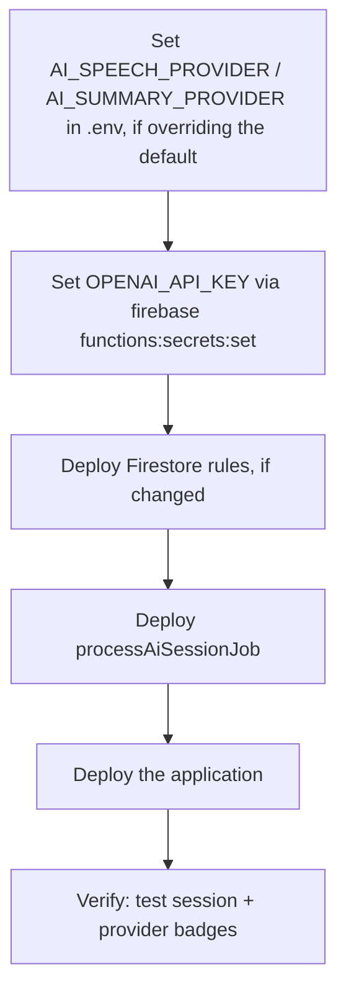

# Engineering 05 — AI Intelligence Platform: Installation & Deployment Guide

**Document version:** 1.2
**Last reviewed:** 2026-08-05
**Audience:** Engineers/DevOps deploying or reconfiguring this module
**Companion documents:** [01 — Technical Architecture](01-technical-architecture.md) · [02 — Developer Guide](02-developer-guide.md) · [03 — API & AI Workflow Guide](03-api-workflow-guide.md) · [04 — Known Limitations & Engineering Notes](04-known-limitations-and-engineering-notes.md)

> This guide assumes the TerraNext Business OS CRM itself is already deployed, following the platform's general deployment runbook (Doc 24). The steps below cover only what is specific to enabling and deploying the AI Intelligence Platform module — they are not a substitute for that runbook.

---

## 1. Prerequisites

- Firebase CLI authenticated against the correct project (`firebase login`, `firebase use <project-id>`), per the general deployment runbook.
- If enabling real AI processing (recommended for production; see §3), an **OpenAI** account and API key — it is the only supported real provider. Without it, the module runs on its zero-credential mock provider (placeholder transcript/summary text).

### 1.1 Classroom recording hardware — nothing to deploy or configure server-side

The classroom hardware support (wireless receiver, USB audio interface, professional mixer — 01 §8.2) is entirely a browser-side capability: it uses only `navigator.mediaDevices`/`MediaRecorder`, the same as the original laptop-mic-only recorder. It adds no secrets, no environment variables, no Cloud Function config, and no Storage/Firestore rule changes beyond the one new `defaultRecordingSource` field on the existing `aiIntelligenceSettings/config` document (already covered by that document's existing `allow write: if false` rule — Admin SDK only, same as every other field on it).

The one deployment-relevant prerequisite is the browser's own **Permissions-Policy** `microphone` directive (`next.config.mjs`) allowing same-origin use — already required for the original laptop-mic recorder and not specific to this feature. `getUserMedia` additionally requires a secure context (HTTPS in production; `localhost` is exempt), which the platform's standard HTTPS deployment already satisfies.

---

## 2. What Gets Deployed

The AI Intelligence Platform ships as part of the CRM's existing Firebase deployment — there is no separate application, project, or hosting target for it.

| Component | Deploys via | Notes |
|---|---|---|
| Firestore security rules for the module's 6 collections (`aiSessions`, `aiProcessingJobs`, `aiTranscripts`, `aiSummaries`, `aiAnalytics`, `aiIntelligenceSettings`) | `firebase deploy --only firestore:rules` | Already part of the project's single `firestore.rules` file — no separate rules file for this module |
| The one Cloud Function, `processAiSessionJob` | `firebase deploy --only functions` (or scoped to `functions:processAiSessionJob`) | Firestore trigger (`onDocumentWritten` on `aiProcessingJobs/{jobId}`); region `asia-south1`; `memory: 1GiB`; `timeoutSeconds: 540` |
| Storage access | No dedicated rules — the project's single blanket-deny `storage.rules` already covers this module's audio chunk paths via server-issued signed URLs | Nothing to deploy specifically for this module |
| Next.js pages, server actions, and UI | `firebase deploy --only apphosting` (or your platform's app deploy step) | Ships as part of the main application build — no separate build/deploy step |

**There is no dedicated "install" step beyond a normal CRM deployment** — the module activates as soon as its code is present in a deployment. What determines whether it produces real AI output or placeholder output is the environment configuration in §3.

---

## 3. Environment Variables & Secrets

The module reads its AI provider configuration through Firebase Functions v2 parameters (`firebase-functions/params`) — regular configuration values via `defineString`, and sensitive values via `defineSecret` (Secret Manager–backed). These are resolved at Cloud Function runtime, not at the Next.js application layer, and are never entered into any CRM screen.

| Variable | Kind | Default if unset | Purpose |
|---|---|---|---|
| `AI_SPEECH_PROVIDER` | `defineString` | `openai` | Set to `mock` to force the zero-credential fallback (e.g. a demo deploy that shouldn't burn API credits). `openai` is the only real value. |
| `AI_SUMMARY_PROVIDER` | `defineString` | `openai` | Same, for summarization |
| `OPENAI_TRANSCRIBE_MODEL` | `defineString` | `whisper-1` | Whisper transcription model id — kept at this default deliberately (see [03 §4.2](03-api-workflow-guide.md#42-openai-transcription--exact-calls)) |
| `OPENAI_SUMMARY_MODEL` | `defineString` | `gpt-4o-mini` | Chat model id, used for both speaker classification and summarization |
| `OPENAI_API_KEY` | `defineSecret` | none | Required for any real (non-mock) call. **This is the only secret `processAiSessionJob` binds** — deploying with the default `openai` provider selection never requires, prompts for, or grants access to any other AI vendor's credentials. |

### 3.1 Setting the string parameters

Following the same convention already used elsewhere in this project's Functions deployment (e.g. `FIRESTORE_EXPORT_BUCKET`), `defineString` parameters are supplied via an environment file in the `functions/` directory — either a shared `functions/.env` or a project-specific `functions/.env.<project-id>` file, which Firebase Functions v2 loads automatically at deploy time. Add the desired values there, for example:

```
AI_SPEECH_PROVIDER=openai
AI_SUMMARY_PROVIDER=openai
OPENAI_SUMMARY_MODEL=gpt-4o-mini
```

Leave every variable unset to get the coded defaults above (`openai`/`openai`/`whisper-1`/`gpt-4o-mini`) — no `.env.<project-id>` file is required at all unless you want to override one of them or force `mock`.

### 3.2 Setting the secret

Secrets are never placed in an `.env` file or committed to the repository. Set it with the Firebase CLI:

```
firebase functions:secrets:set OPENAI_API_KEY
```

This prompts for the secret value interactively and stores it in Secret Manager.

**Warning:** If `OPENAI_API_KEY` is missing or invalid while `AI_SPEECH_PROVIDER`/`AI_SUMMARY_PROVIDER` is `openai`, the module does **not** fail loudly — it silently falls back to the mock provider, and every session will complete "successfully" with placeholder transcript and summary text. Always verify (§5) after changing this configuration.

---

## 4. Deployment Steps



1. Complete §3 (string parameters in the `functions/.env`/`functions/.env.<project-id>` file, secrets via `firebase functions:secrets:set`).
2. If this is the first deployment of the module, or if `firestore.rules` has changed, deploy rules first:
   ```
   firebase deploy --only firestore:rules
   ```
3. Deploy the Cloud Function:
   ```
   firebase deploy --only functions:processAiSessionJob
   ```
   (Or `firebase deploy --only functions` if deploying alongside other function changes.)
4. Deploy the application (Next.js pages, server actions):
   ```
   firebase deploy --only apphosting
   ```
   (Or your platform's equivalent app deploy step, per Doc 24.)

---

## 5. Verifying the Deployment

1. Sign in with a System Administrator or Founder account and open **AI Intelligence Platform → Settings**.
2. Record a short test session (a Trainer, System Administrator, or Founder account can do this) — a minute or two is enough.
3. Once the session reaches **Completed**, reopen **Settings** and confirm the **Active speech provider** / **Active summary provider** badges show `openai`, not the default demonstration mode.
4. Open the test session's **Summary** and **Transcript** tabs and confirm real content was generated rather than the placeholder sentence describing an unconfigured provider.
5. If the badges still show demonstration mode or the job failed, see §6 and the debugging checklist in [03 — API & AI Workflow Guide §8](03-api-workflow-guide.md#8-debugging-checklist-for-apiprovider-issues).

---

## 6. Switching Back to Mock, Model Overrides, and Rollback

- **Changing the transcribe/summary model** (e.g. trying a different OpenAI chat model for summarization) is a configuration-only change: update `OPENAI_TRANSCRIBE_MODEL`/`OPENAI_SUMMARY_MODEL` and redeploy the function per §4 steps 1 and 3. No code changes or data migration are involved — model selection is independent of any previously completed sessions' stored data.
- **Fast mitigation during an incident** — if OpenAI is down or misbehaving and you need to stop new sessions from failing while you investigate, set `AI_SPEECH_PROVIDER`/`AI_SUMMARY_PROVIDER` to `mock` and redeploy. Sessions will complete with placeholder content rather than failing outright, which keeps the recording → processing → completed workflow unblocked for trainers while the underlying provider issue is resolved.
- **Rolling back the function code itself** follows the same rollback mechanism as any other Cloud Function in this project — see Doc 24 §2.1.

---

## 7. Post-Deployment Checklist

- [ ] `functions/.env`/`functions/.env.<project-id>` contains the intended `AI_SPEECH_PROVIDER`/`AI_SUMMARY_PROVIDER`/model values, or is left absent entirely to use the coded defaults (`openai`/`openai`/`whisper-1`/`gpt-4o-mini`)
- [ ] `OPENAI_API_KEY` set via `firebase functions:secrets:set` (skip only if intentionally running on `mock` for demonstration use)
- [ ] `firestore:rules` deployed and current
- [ ] `processAiSessionJob` deployed
- [ ] Application deployed
- [ ] A test session was recorded end-to-end and reached **Completed** with real (non-placeholder) content, if `OPENAI_API_KEY` was configured
- [ ] Settings screen provider badges match the intended configuration
- [ ] Relevant staff informed of which provider is active, per the [Operations Manual](../client/03-operations-manual.md)
